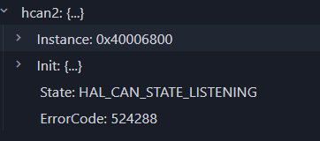

---
title: "DeBug手册"
slug: debug-shouce
date: 2026-06-21
categories: ["教程"]
tags: ["调试", "CAN", "嵌入式"]
---
# DeBug手册

## CAN

### ErroCode:524288,State:Listen

如图：

ErroCode:54288=0x100000, –>HAL_CAN_ERRO_NOT_STARTED

可能是未调用HAL_CAN_START函数，也有可能是==重复调用Start==

